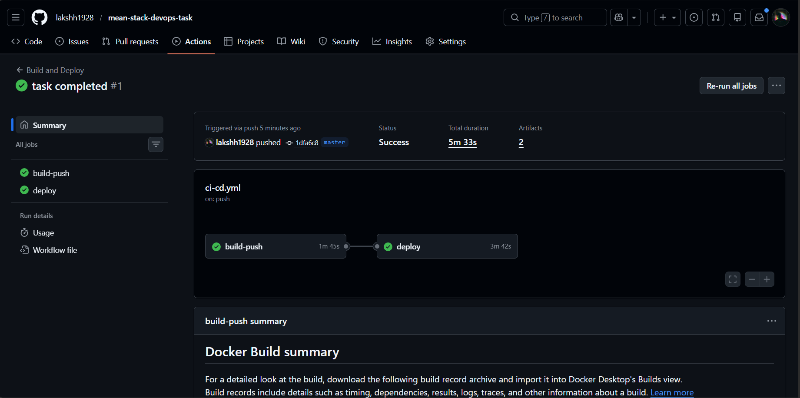
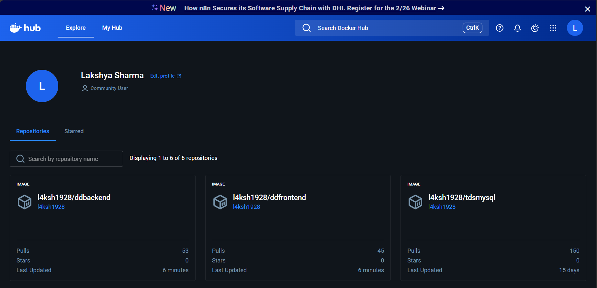
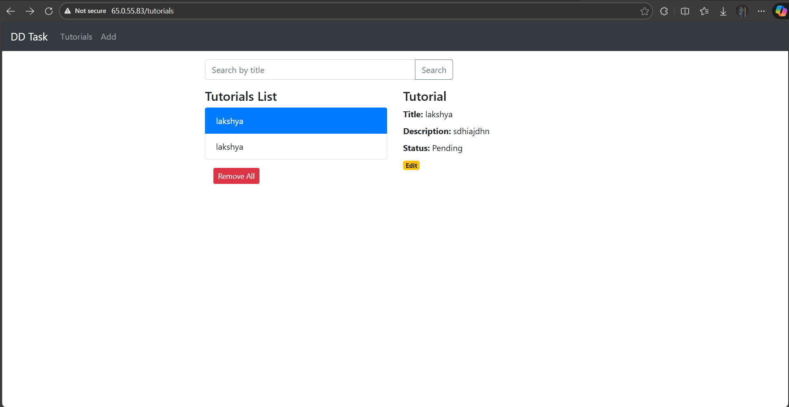
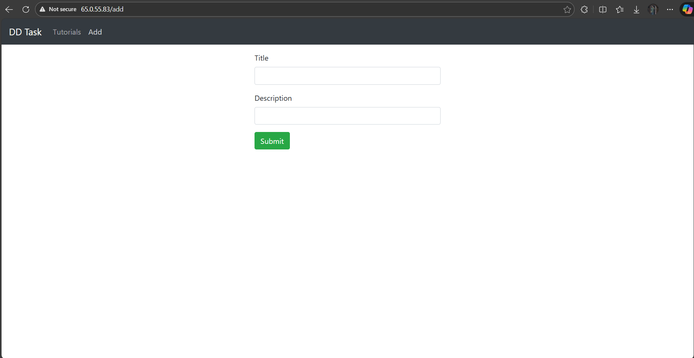

# MEAN Stack CRUD Application - DevOps Task

A containerized full-stack MEAN (MongoDB, Express, Angular 15, Node.js) application with an automated CI/CD pipeline and cloud deployment.

## 🛠 Tech Stack & Tools
* **Frontend:** Angular 15 (Nginx for production serving).
* **Backend:** Node.js / Express API.
* **Database:** MongoDB 6.0.
* **Infrastructure:** Ubuntu 22.04 LTS (AWS EC2).
* **CI/CD:** GitHub Actions.
* **Containerization:** Docker & Docker Compose.


## 🚀 DevOps Workflow
1. **Containerization:** Created multi-stage Dockerfiles for optimized production images.
2. **Orchestration:** Used Docker Compose to manage the frontend, backend, and database services.
3. **CI/CD Pipeline:** Configured GitHub Actions to automatically:
    * Build and push images to Docker Hub.
    * Deploy updates via SSH to the production VM.
4. **Reverse Proxy:** Configured Nginx to handle traffic on Port 80 and route `/api` calls to the backend service.

## ✅ Implementation Proofs
*Note: The cloud infrastructure is currently in a "Stopped" state to optimize resource usage as per assignment guidelines. Proof of successful execution is provided below.*

### 1. Automation (GitHub Actions)
Fully green pipeline showing successful build, push, and deployment stages.


### 2. Container Registry (Docker Hub)
Images pushed and tagged: `l4ksh1928/ddfrontend` and `l4ksh1928/ddbackend`.


### 3. Production Deployment Status
Docker containers running successfully on the Ubuntu VM with Port 80 mapping.


### 4. Application UI
Full CRUD functionality verified on the production server.



## 📦 Local Setup
To run this project locally:
```bash
git clone [https://github.com/lakshh1928/mean-stack-devops-task.git](https://github.com/lakshh1928/mean-stack-devops-task.git)
cd mean-stack-devops-task
docker compose up -d
